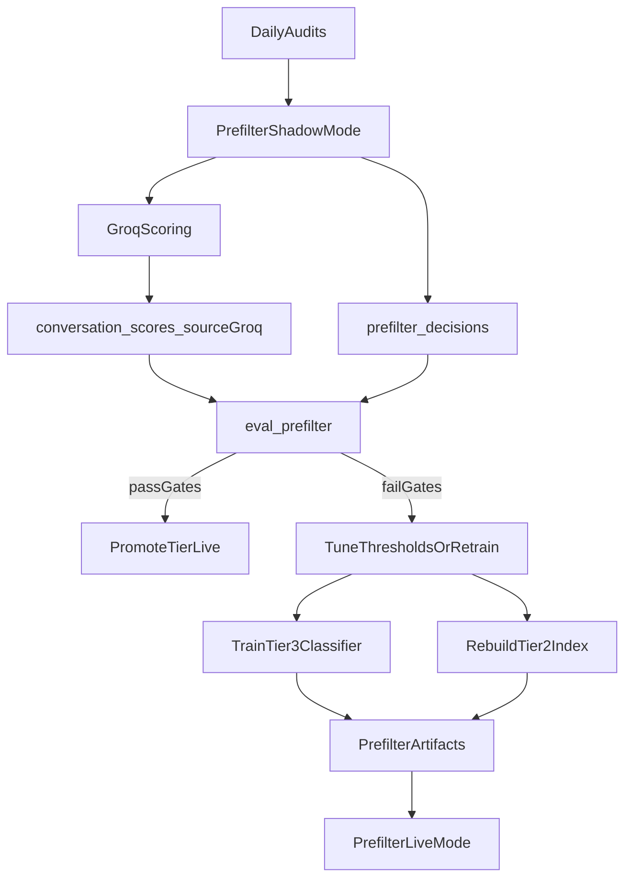

## Goal (real-world, not fake)
- **Primary KPI**: reduce Groq calls by **~20%** (since you said we can depend on it ~20%).
- **Safety KPI**: keep **FALSE-CLEAN** (prefilter said clean, but Groq would have flagged) at **≤2–5%**. For “balanced”, I recommend starting with **≤2%**.
- **Operational KPI**: prefilter never blocks audits; worst case it escalates to Groq.

## What you already have (so we don’t reinvent)
- **Prefilter runtime entry**: `[ai/prefilter/pipeline.py](ai/prefilter/pipeline.py)` `run_prefilter(...) -> dict | None`
  - Returns **Groq-shaped result dict** only when short-circuiting; otherwise returns `None` to escalate.
  - **Shadow mode** exists (records decisions, but always escalates): `settings.PREFILTER_SHADOW_MODE`.
- **Tier 1 (rules)**: `[ai/prefilter/tier1_phrases.py](ai/prefilter/tier1_phrases.py)`
  - Escalates on explicit opt-out / suspicious patterns.
  - Short-circuits only trivially clean threads.
- **Tier 2 (kNN)**: `[ai/prefilter/tier2_embedding.py](ai/prefilter/tier2_embedding.py)`
  - FAISS index + metadata; short-circuits only if top neighbors are clean and similarity passes threshold.
- **Tier 3 (classifier)**: `[ai/prefilter/tier3_classifier.py](ai/prefilter/tier3_classifier.py)`
  - `classifier.joblib` bundle trained by `[ai/prefilter/train.py](ai/prefilter/train.py)`.
- **Evaluation harness**: `[scripts/eval_prefilter.py](scripts/eval_prefilter.py)`
  - Reports tier hit rates + **FALSE-CLEAN** + projected Groq calls saved.
- **DB support**:
  - `[database/migrations/001_add_prefilter_tables.sql](database/migrations/001_add_prefilter_tables.sql)` creates `prefilter_decisions`, `conversation_embeddings`, and `conversation_scores.source`.

## Production workflow (the “perfect” loop)
### Phase A — Data collection (always-on, low-risk)
- Keep **prefilter enabled**, but run in **shadow mode** until you have enough evidence.
- Daily operation:
  - Run audits normally (dashboard or CLI).
  - Prefilter writes rows into `prefilter_decisions` (tier hit, decision, confidence, predicted scores).
  - Groq remains the truth source (conversation_scores.source = `groq`).

### Phase B — Weekly evaluation (numbers decide)
- Run replay eval on recent Groq-scored convos:
  - Use `[scripts/eval_prefilter.py](scripts/eval_prefilter.py)` with a fixed window (example: last 300–500 scored convos).
- Acceptance gates to *promote* a tier from shadow → live:
  - **Tier 1 live**: allow if FALSE-CLEAN ≤2% and savings ≥5%.
  - **Tier 2 live**: allow if FALSE-CLEAN ≤2% and savings ≥10% (Tier2+Tier1 combined).
  - **Tier 3 live**: allow if FALSE-CLEAN ≤2% and savings ≥20% (all combined), with stable results for 2 consecutive evals.

### Phase C — Promote tiers gradually (hit the 20% target safely)
- Start with:
  - `PREFILTER_SHADOW_MODE=true`
  - `PREFILTER_T1_LIVE=true`, `PREFILTER_T2_LIVE=false`, `PREFILTER_T3_LIVE=false`
- Promote in this order only:
  1. Tier 1 → live
  2. Tier 2 → live
  3. Tier 3 → live
- Keep **flag-trigger routing enabled** (`PREFILTER_FLAG_ROUTING_ENABLED=true`) permanently so risky patterns always go to Groq.

### Phase D — Retraining cadence (keeps it “real world”)
- **Tier 2 index rebuild** (embedding kNN):
  - Trigger: every time you add meaningful new audited data (e.g., +200 conversations), or weekly.
  - Command: use the existing builder referenced in Tier2 logs (see `[ai/prefilter/tier2_embedding.py](ai/prefilter/tier2_embedding.py)` message).
- **Tier 3 retrain**:
  - Trigger: weekly, or when FALSE-CLEAN rises.
  - Command: `python -m ai.prefilter.train --test-split 0.2`
  - Use `flag_feedback` invalid patterns (already used in `[ai/prefilter/train.py](ai/prefilter/train.py)` via `fetch_invalid_flag_patterns`) so training doesn’t learn known false-positive flags.

## Guardrails (prevents “fake answers”)
- **Never predict flags**: ML only decides “safe to skip Groq” vs “send to Groq”. (Matches your selection.)
- **Hard bypass**: opt-outs / profanity / offers / wrong-number pushing patterns must bypass ML (Tier1 + `PREFILTER_FLAG_ROUTING_ENABLED`).
- **Strict thresholds** (balanced mode):
  - Prefer raising `PREFILTER_T2_SIM_THRESHOLD` and lowering `PREFILTER_T3_MAX_FLAG_PROB` until FALSE-CLEAN is consistently low.
- **Fail-open**: if Tier2/Tier3 artifacts missing or load fails, pipeline escalates to Groq (already implemented).

## “Good structure” for ML (keep it maintainable)
Keep ML as a contained subsystem with these conventions:
- **Runtime**: `[ai/prefilter/](ai/prefilter/)` only (no ML logic in `ai/analyzer.py` beyond calling `run_prefilter`).
- **Artifacts**: store only in `ai/prefilter/artifacts/` (already in `config/settings.py`).
  - `knn_index.faiss`, `knn_index_meta.json`, `classifier.joblib`
- **Repro metadata**: every rebuild/train should write a small JSON alongside artifacts:
  - `artifacts/manifest.json` with: embedding model name, trained_at, n_train, thresholds used.
- **Eval scripts**: keep in `[scripts/](scripts/)` (already have `eval_prefilter.py`).

## Dashboard workflow (so you can trust it)
- Run weekly: `python scripts/eval_prefilter.py --limit 500 --since <date>`
- Record the printed summary into a dated doc under `docs/` (so promotion decisions are auditable).

## Defaults I will use in implementation (unless you override later)
- Balanced target: **~20% Groq reduction** with **≤2% FALSE-CLEAN**.
- Promote **Tier 1** first, then **Tier 2**, then **Tier 3**.
- Keep `PREFILTER_FLAG_ROUTING_ENABLED=true` permanently.
